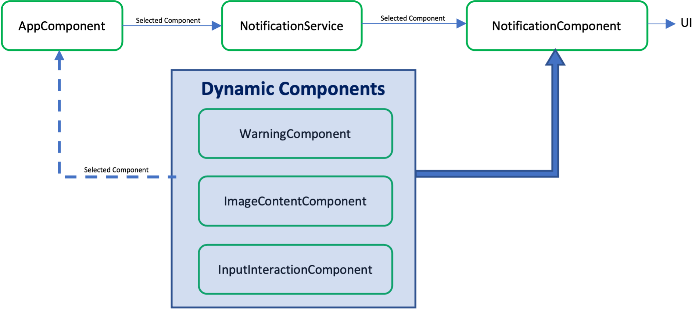

#   <svg xmlns="http://www.w3.org/2000/svg" height="4em" viewBox="0 0 448 512"><!--! Font Awesome Free 6.4.2 by @fontawesome - https://fontawesome.com License - https://fontawesome.com/license (Commercial License) Copyright 2023 Fonticons, Inc. --><path d="M185.7 268.1h76.2l-38.1-91.6-38.1 91.6zM223.8 32L16 106.4l31.8 275.7 176 97.9 176-97.9 31.8-275.7zM354 373.8h-48.6l-26.2-65.4H168.6l-26.2 65.4H93.7L223.8 81.5z"/></svg> Angular Dynamic Components: Dynamic Overays 

This is a demo application for dynamic components. It is based on the following article/demo-code (credits!):

https://medium.com/@damodara.puddu/when-to-use-angulars-dynamic-components-ce40db069359

## Components and Services

### AppComponent
It accesses the NotificationService and passes in it the WarningComponent for new dynamic notification instantiation, upon button click.
### Dynamic Components:
WarningComponent, ImageContentComponent, InputInteractionComponent
This are the ‘dynamic’ components. Any component can be also a dynamic component. The point is thata component is dynamically loaded. Each one actually, does nothing but offers only itself as a dynamic content.
### NotificationComponent
Acts as host/parent/container component of the WarningComponent ‘dynamic’ component (Or any other component). In its template, it uses a template reference variable (the ‘#notificationTemplate’) inside a ng-template pair of tags. It accesses its child-component view-container the via the ViewContainerRef. It creates/instantiates its child-component in the AfterViewInit lifehook. It has also responsibility for closing itself (the whole component including its child component in ng-template) upon the click event on the X icon. Note: It is created/instantiated only via the NotificationService, i.e. via the click of the button in the AppComponent, which also passes the child component type.
### NotificationService
It deals only with the NotificationComponent component. It creates/instantiates it. But it also assigns its property: childComponentType. Then the NotificationComponent instantiates it (in the AfterViewInit lifehook) for the notificationTemplate template reference/anchor.
### Notes:
Even the NotificationComponent has a selector ('notification'), its selector is not used. Since it is an overlay, it should be displayed on top of the template of the component that triggers it. In the example case it is on top of the AppComponent template. Its position on the host template is define in its stylesheet with the :host pseudo-class selector.
The Type of the dynamic component is totally agnostic and can be substituted with any other component!

## Default Instructions
This project was generated with [Angular CLI](https://github.com/angular/angular-cli) version 16.2.0.

## Development server

Run `ng serve` for a dev server. Navigate to `http://localhost:4200/`. The application will automatically reload if you change any of the source files.

## Code scaffolding

Run `ng generate component component-name` to generate a new component. You can also use `ng generate directive|pipe|service|class|guard|interface|enum|module`.

## Build

Run `ng build` to build the project. The build artifacts will be stored in the `dist/` directory.

## Running unit tests

Run `ng test` to execute the unit tests via [Karma](https://karma-runner.github.io).

## Running end-to-end tests

Run `ng e2e` to execute the end-to-end tests via a platform of your choice. To use this command, you need to first add a package that implements end-to-end testing capabilities.

## Further help

To get more help on the Angular CLI use `ng help` or go check out the [Angular CLI Overview and Command Reference](https://angular.io/cli) page.
